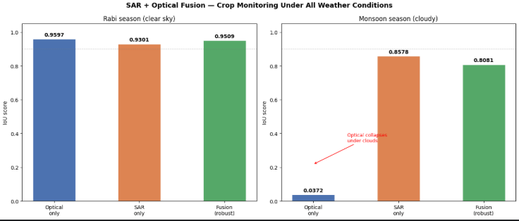
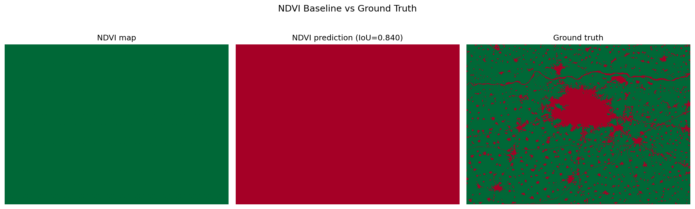
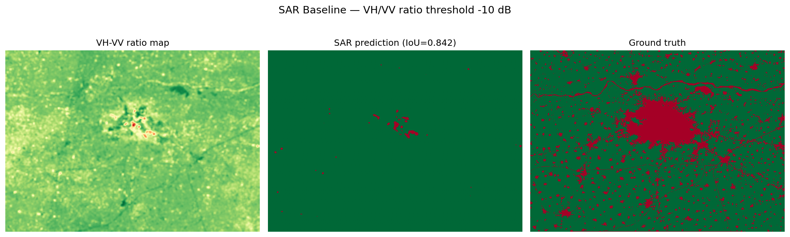

# MOSAIC
### Multi-Sensor Adaptive Crop Monitoring System for Cloud-Affected Regions
 
**SAR + Optical Fusion for Crop Monitoring Under All Weather Conditions**
 

 
> *Optical collapses 96% during monsoon. SAR holds up but has a lower ceiling. This fusion model matches optical in clear sky and comes within a few points of SAR in monsoon — it's the only model that performs well in both conditions.*
 
---
 
## Why This Project Exists
 
India's agricultural monitoring depends heavily on optical satellite imagery (Sentinel-2). But optical sensors go blind during monsoon — clouds block the signal entirely. The Kharif season (June–September), when rice and other critical crops are growing, is also India's cloudiest period. **You lose the data exactly when you need it most.**
 
SAR (Synthetic Aperture Radar) sensors like Sentinel-1 see through clouds and work at night. But SAR alone has a lower accuracy ceiling than optical in clear-sky conditions.
 
This project builds a **fusion model** that uses both — leaning on optical when the sky is clear, and falling back on SAR when clouds take over.
 
This is exactly the problem that [GalaxEye's OptoSAR satellite](#related-work) (launched May 2026) was built to solve.
 
---
 
## Results
 
### Clear sky — Rabi season (Dec 2021 – Apr 2022)
 
| Model | IoU | F1 |
|---|:---:|:---:|
| NDVI threshold *(classical)* | 0.9063 | 0.9508 |
| SAR threshold *(classical)* | 0.8424 | 0.9144 |
| U-Net — optical only | 0.9597 | — |
| U-Net — SAR only | 0.9301 | — |
| **U-Net — fusion (robust)** | **0.9509** | — |
 
### Monsoon season — cloudy (Jun – Sep 2022)
 
| Model | IoU | Drop from clear sky |
|---|:---:|:---:|
| Optical only | 0.0372 | 🔴 −96.1% |
| SAR only | 0.8578 | 🟡 −7.8% |
| **Fusion (robust)** | **0.8081** | 🟢 −15.0% |
 
**The key result:** optical collapses catastrophically under clouds — dropping 96%. The fusion model, trained with *modality dropout* to handle missing optical data, comes within a few points of SAR's monsoon performance while matching optical's clear-sky performance almost exactly. It is the only model that performs well in **both** conditions.
 

 
---
 
## Classical Baselines
 
<table>
<tr>
<td width="50%"><p align="center"><em>NDVI baseline</em></p></td>
<td width="50%"><p align="center"><em>SAR baseline</em></p></td>
</tr>
</table>
---
 
## Study Area
 
**Ludhiana district, Punjab, India** — one of India's most productive wheat-growing regions.
 
- **Training area:** Ludhiana patch (~50×50 km), Rabi season
- **Labels:** ESRI Global Land Cover 2022 (crop / non-crop binary mask)
- **Crop coverage:** 84% (heavily agricultural, as expected for Punjab)
---
 
## Technical Approach
 
### Data pipeline
 
| Sensor | Source | Bands | Notes |
|---|---|---|---|
| SAR | Sentinel-1 GRD | VV, VH | IW mode, descending orbit, via Google Earth Engine |
| Optical | Sentinel-2 SR Harmonized | B2, B3, B4, B8 (Blue, Green, Red, NIR) | Cloud filter < 20% |
 
**Preprocessing:** speckle filtering (focal mean) → Sentinel-2 reflectance scaling (÷10000) → band normalization to [0, 1]
**Resolution:** 100m for training, exportable to 20m for inference
 
### Model architecture
 
Lightweight U-Net:
 
- **Encoder:** 3 × DoubleConv blocks (32 → 64 → 128 channels) + MaxPool
- **Bottleneck:** 256 channels
- **Decoder:** 3 × ConvTranspose2d + skip connections
- **Output:** 2-class segmentation (crop / non-crop)
Three variants trained:
 
| Variant | Input channels | Bands used |
|---|:---:|---|
| Optical only | 4 | B2, B3, B4, B8 |
| SAR only | 2 | VV, VH |
| Fusion | 6 | VV, VH, B2, B3, B4, B8 |
 
### Modality dropout — the key innovation
 
The fusion model is trained with **modality dropout**: 30% of training *samples* randomly zero out all optical bands, forcing the model to learn SAR-only prediction.
 
```python
for i in range(imgs.shape[0]):
    if random.random() < 0.3:
        imgs[i, 2:6] = 0  # zero out B2, B3, B4, B8 — simulate cloud cover
```
 
During monsoon inference, optical bands are masked to zero (clouds = no signal). The model recognises this as the scenario it was trained for and relies on SAR. This technique is known in multimodal deep learning as **graceful degradation** — the model doesn't panic when one modality is unavailable.
 
> **Note — dropout probability and granularity matter.** Applying dropout per-sample at 30% produced a fusion model that generalises well (0.8081 monsoon IoU). An earlier attempt at 50% dropout applied per-*batch* caused the model to collapse (0.0464 monsoon IoU) — likely because inconsistent input distributions across batches destabilised BatchNorm's running statistics.
 
### Training config
 
| Parameter | Value |
|---|---|
| Patch size | 64×64, stride 32 (overlapping patches) |
| Train/val split | 80/20 |
| Optimizer | Adam, lr=1e-3 |
| Loss | CrossEntropyLoss |
| Epochs | 30 |
| Hardware | Kaggle T4 GPU |
 
---
 
## Repo Structure
 
```
sar-crop-monitoring/
├── notebook.ipynb          # Full pipeline: data → baselines → models → evaluation
├── hero_figure.png         # Clear sky vs monsoon comparison (README header figure)
├── model_comparison.png    # Side-by-side predictions of all 3 models
├── ndvi_baseline.png       # Classical NDVI baseline visualisation
├── sar_baseline.png        # Classical SAR baseline visualisation
└── README.md
```
 
---
 
## How to Run
 
1. Open `notebook.ipynb` on Kaggle (GPU recommended)
2. Add your GEE service account JSON as a Kaggle secret named `gee`
3. Run all cells in order — data is pulled live from Google Earth Engine
**Dependencies:** `earthengine-api`, `geemap`, `rasterio`, `torch`, `segmentation-models-pytorch`, `scikit-learn`, `matplotlib`, `Pillow`
 
---
 
## What I Learned
 
- SAR preprocessing: speckle filtering, VV/VH polarization, dB scale interpretation
- Why Sentinel-2 values need ÷10000 scaling before computing spectral indices
- Modality dropout as a training technique for robust multimodal models — and how dropout probability and granularity (per-sample vs. per-batch) significantly affect whether it works
- The commercial case for SAR+optical fusion — exactly what GalaxEye's Drishti satellite was built for
- How to frame a research experiment as a product story
---
 
## Related Work
 
- [GalaxEye Mission Drishti](#) (May 2026) — world's first OptoSAR satellite
- [NASA-ISRO NISAR](#) (2025) — dual-frequency SAR for earth observation
- [SatSure](#) — crop intelligence platform using multi-sensor data
---
 
<p align="center"><em>Built as part of a computer vision portfolio targeting Indian space tech internships.</em></p>
